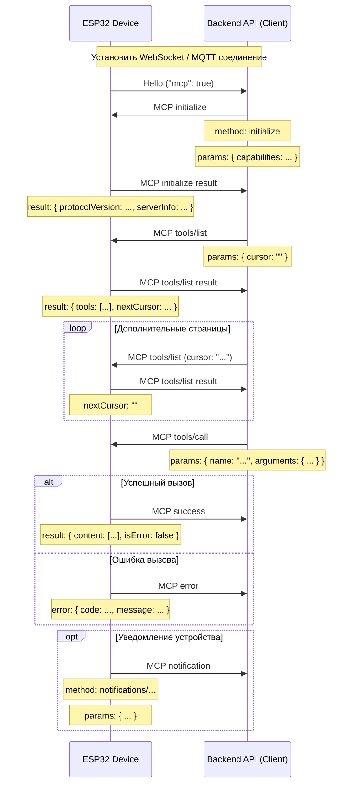

# Обмен по протоколу MCP (Model Context Protocol)

NOTICE: документ подготовлен при помощи ИИ. При реализации серверной части обязательно сверяйтесь с исходным кодом!

В этом проекте протокол MCP служит для связи между серверным API (MCP‑клиентом) и устройством ESP32 (MCP‑сервером), чтобы бэкенд мог обнаруживать и вызывать функции («инструменты») устройства.

## Формат протокола

Согласно исходным файлам (`main/protocols/protocol.cc`, `main/mcp_server.cc`), MCP‑сообщения инкапсулируются поверх базового транспорта (WebSocket, MQTT и др.) и соответствуют [JSON-RPC 2.0](https://www.jsonrpc.org/specification).

Общий пример сообщения:

```json
{
  "session_id": "...", // идентификатор сессии
  "type": "mcp",       // тип сообщения, всегда "mcp"
  "payload": {         // полезная нагрузка JSON-RPC 2.0
    "jsonrpc": "2.0",
    "method": "...",   // имя метода (например, "initialize", "tools/list", "tools/call")
    "params": { ... }, // параметры метода (для запросов)
    "id": ...,         // идентификатор запроса (для запросов и ответов)
    "result": { ... }, // результат выполнения (успешный ответ)
    "error": { ... }   // описание ошибки (ошибочный ответ)
  }
}
```

`payload` — это стандартное сообщение JSON-RPC 2.0:

- `jsonrpc`: неизменная строка "2.0".
- `method`: имя вызываемого метода (для запросов).
- `params`: параметры метода, чаще всего объект.
- `id`: идентификатор запроса; клиент задаёт его и ожидает получить в ответе.
- `result`: данные успешного ответа.
- `error`: информация о сбое.

## Ход взаимодействия и моменты отправки

Взаимодействие MCP основано на том, что клиент (серверное API) обнаруживает и вызывает инструменты устройства.

1.  **Установление соединения и объявление возможностей**

    - **Когда:** устройство запустилось и подключилось к серверу.
    - **Отправитель:** устройство.
    - **Сообщение:** базовое `hello`, в котором перечисляются возможности (например, `"mcp": true`).
    - **Пример (это не MCP‑payload, а транспортное сообщение):**
      ```json
      {
        "type": "hello",
        "version": ...,
        "features": {
          "mcp": true,
          ...
        },
        "transport": "websocket", // либо "mqtt"
        "audio_params": { ... },
        "session_id": "..." // может быть присвоен после ответа сервера
      }
      ```

2.  **Инициализация MCP‑сессии**

    - **Когда:** сервер получил `hello` и убедился, что устройство поддерживает MCP.
    - **Отправитель:** серверное API (клиент).
    - **Метод:** `initialize`
    - **Пример MCP‑payload:**

      ```json
      {
        "jsonrpc": "2.0",
        "method": "initialize",
        "params": {
          "capabilities": {
            // опциональные возможности клиента

            // пример для визуального канала
            "vision": {
              "url": "...", // HTTP‑адрес обработки видео/изображений
              "token": "..." // токен доступа
            }

            // ... другие возможности
          }
        },
        "id": 1
      }
      ```

    - **Ответ устройства:** после обработки `initialize`.
      ```json
      {
        "jsonrpc": "2.0",
        "id": 1,
        "result": {
          "protocolVersion": "2024-11-05",
          "capabilities": {
            "tools": {} // подробности не передаются, нужен вызов tools/list
          },
          "serverInfo": {
            "name": "...", // имя устройства (BOARD_NAME)
            "version": "..." // версия прошивки
          }
        }
      }
      ```

3.  **Получение списка инструментов**

    - **Когда:** клиенту нужно узнать доступные функции устройства.
    - **Отправитель:** серверное API.
    - **Метод:** `tools/list`
    - **Пример запроса:**
      ```json
      {
        "jsonrpc": "2.0",
        "method": "tools/list",
        "params": {
          "cursor": "" // курсор для пагинации; первый запрос — пустая строка
        },
        "id": 2
      }
      ```
    - **Ответ устройства:**
      ```json
      {
        "jsonrpc": "2.0",
        "id": 2,
        "result": {
          "tools": [
            {
              "name": "self.get_device_status",
              "description": "...",
              "inputSchema": { ... }
            },
            {
              "name": "self.audio_speaker.set_volume",
              "description": "...",
              "inputSchema": { ... }
            }
            // ... другие инструменты
          ],
          "nextCursor": "..." // если результатов много, используется пагинация
        }
      }
      ```
    - **Пагинация:** пока `nextCursor` не пустой, необходимо повторять `tools/list`, передавая полученный курсор.

4.  **Вызов инструмента**

    - **Когда:** нужно выполнить конкретную операцию на устройстве.
    - **Отправитель:** серверное API.
    - **Метод:** `tools/call`
    - **Пример запроса:**
      ```json
      {
        "jsonrpc": "2.0",
        "method": "tools/call",
        "params": {
          "name": "self.audio_speaker.set_volume",
          "arguments": {
            "volume": 50
          }
        },
        "id": 3
      }
      ```
    - **Успешный ответ:**
      ```json
      {
        "jsonrpc": "2.0",
        "id": 3,
        "result": {
          "content": [
            { "type": "text", "text": "true" }
          ],
          "isError": false
        }
      }
      ```
    - **Ответ с ошибкой:**
      ```json
      {
        "jsonrpc": "2.0",
        "id": 3,
        "error": {
          "code": -32601,
          "message": "Unknown tool: self.non_existent_tool"
        }
      }
      ```

5.  **Уведомления устройства (Notifications)**
    - **Когда:** на устройстве произошли события, о которых нужно сообщить (например, изменение состояния). Наличие `Application::SendMcpMessage` намекает на такую возможность.
    - **Отправитель:** устройство (сервер).
    - **Методы:** часто имеют префикс `notifications/`, но название произвольное.
    - **Формат:** сообщение JSON-RPC без поля `id`.
      ```json
      {
        "jsonrpc": "2.0",
        "method": "notifications/state_changed",
        "params": {
          "newState": "idle",
          "oldState": "connecting"
        }
      }
      ```
    - **Обработка на сервере:** уведомления не требуют ответа.

## Диаграмма обмена

Ниже приведён упрощённый sequence‑diagram, демонстрирующий основные MCP‑сообщения:



Эта документация описывает основной процесс обмена MCP в проекте. За конкретными параметрами и реализациями инструментов обращайтесь к `main/mcp_server.cc`, функциям `McpServer::AddCommonTools` и соответствующему коду инструментов.
