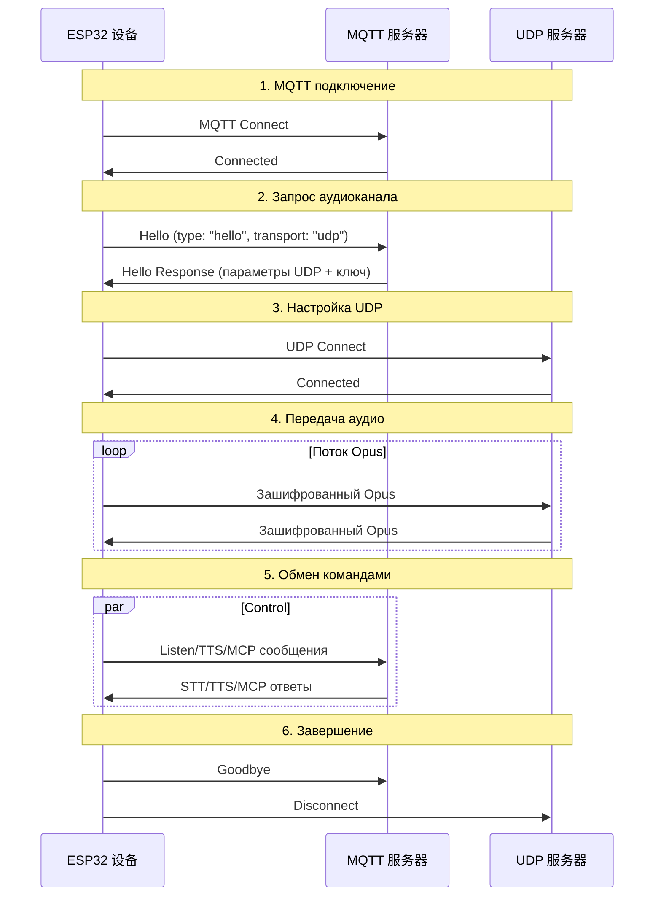
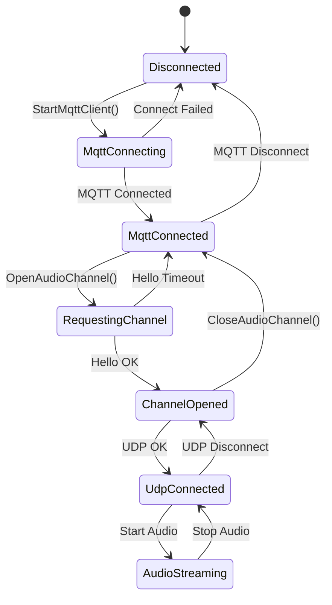

# Документация по гибридному протоколу MQTT + UDP

Документ основан на исходном коде и описывает, как устройство и сервер обмениваются данными: управление и состояния идут по MQTT, а аудиопотоки — по UDP.

---

## 1. Обзор протокола

Протокол использует комбинированный транспорт:
- **MQTT** — управление, синхронизация состояний, передача JSON
- **UDP** — потоковое аудио в реальном времени с шифрованием

### 1.1 Ключевые особенности

- **Два канала**: команды и аудио разделены для лучшей задержки
- **Шифрование**: аудио в UDP защищено AES-CTR
- **Последовательности**: защита от повтора и перепутанных пакетов
- **Автопереподключение**: MQTT восстанавливается автоматически

---

## 2. Общий ход работы



---

## 3. MQTT — канал управления

### 3.1 Установление соединения

Устройство подключается к брокеру MQTT с параметрами:
- **Endpoint** — адрес/порт брокера
- **Client ID** — уникальный идентификатор устройства
- **Username/Password** — учётные данные
- **Keep Alive** — интервал keepalive (по умолчанию 240 с)

### 3.2 Обмен сообщениями hello

#### 3.2.1 Hello от устройства

```json
{
  "type": "hello",
  "version": 3,
  "transport": "udp",
  "features": {
    "mcp": true
  },
  "audio_params": {
    "format": "opus",
    "sample_rate": 16000,
    "channels": 1,
    "frame_duration": 60
  }
}
```

#### 3.2.2 Hello от сервера

```json
{
  "type": "hello",
  "transport": "udp",
  "session_id": "xxx",
  "audio_params": {
    "format": "opus",
    "sample_rate": 24000,
    "channels": 1,
    "frame_duration": 60
  },
  "udp": {
    "server": "192.168.1.100",
    "port": 8888,
    "key": "0123456789ABCDEF0123456789ABCDEF",
    "nonce": "0123456789ABCDEF0123456789ABCDEF"
  }
}
```

**Пояснения:**
- `udp.server` — адрес UDP‑сервера
- `udp.port` — порт UDP‑сервера
- `udp.key` — ключ AES (hex)
- `udp.nonce` — одноразовый счётчик AES (hex)

### 3.3 Типы JSON‑сообщений

#### 3.3.1 От устройства к серверу

1. **Listen**
   ```json
   {
     "session_id": "xxx",
     "type": "listen",
     "state": "start",
     "mode": "manual"
   }
   ```

2. **Abort**
   ```json
   {
     "session_id": "xxx",
     "type": "abort",
     "reason": "wake_word_detected"
   }
   ```

3. **MCP**
   ```json
   {
     "session_id": "xxx",
     "type": "mcp",
     "payload": {
       "jsonrpc": "2.0",
       "id": 1,
       "result": { ... }
     }
   }
   ```

4. **Goodbye**
   ```json
   {
     "session_id": "xxx",
     "type": "goodbye"
   }
   ```

#### 3.3.2 От сервера к устройству

Те же типы, что и в WebSocket‑протоколе:
- **STT** — результат распознавания речи
- **TTS** — управление синтезом
- **LLM** — эмоции / выражения
- **MCP** — управление устройством
- **System** — системные команды
- **Custom** — пользовательские сообщения (опционально)

---

## 4. UDP — аудиоканал

### 4.1 Настройка соединения

После получения ответа hello устройство:
1. Берёт адрес и порт UDP
2. Извлекает ключ и `nonce`
3. Инициализирует AES-CTR
4. Открывает UDP‑сокет

### 4.2 Формат аудиоданных

#### 4.2.1 Структура шифрованного пакета

```
|type 1byte|flags 1byte|payload_len 2bytes|ssrc 4bytes|timestamp 4bytes|sequence 4bytes|
|payload payload_len bytes|
```

Поля:
- `type` — тип пакета, 0x01
- `flags` — резерв
- `payload_len` — длина полезной нагрузки (network byte order)
- `ssrc` — идентификатор источника
- `timestamp` — отметка времени (network byte order)
- `sequence` — порядковый номер (network byte order)
- `payload` — зашифрованные данные Opus

#### 4.2.2 Шифрование

Используется **AES-CTR**:
- **Ключ** — 128 бит, выдаётся сервером
- **Nonce** — 128 бит, выдаётся сервером
- **Счётчик** — включает timestamp и sequence

### 4.3 Управление последовательностями

- Отправитель: `local_sequence_` растёт монотонно
- Получатель: `remote_sequence_` проверяет непрерывность
- Защита от повтора: пакеты с номером меньше ожидаемого отклоняются
- Допуск: небольшие скачки допускаются с фиксацией предупреждения

### 4.4 Обработка ошибок

1. **Ошибка расшифровки** — логируем, пакет отбрасывается
2. **Аномалия последовательности** — предупреждение, пакет можно обработать
3. **Неверный формат** — логируем и отбрасываем

---

## 5. Управление состояниями

### 5.1 Диаграмма состояний



### 5.2 Проверка готовности аудиоканала

```cpp
bool IsAudioChannelOpened() const {
    return udp_ != nullptr && !error_occurred_ && !IsTimeout();
}
```

---

## 6. Конфигурация

### 6.1 Настройки MQTT

Получаются из конфигурации:
- `endpoint`
- `client_id`
- `username`
- `password`
- `keepalive`
- `publish_topic`

### 6.2 Аудиопараметры

- **Формат**: Opus
- **Частота**: 16000 Гц (устройство) / 24000 Гц (сервер)
- **Каналы**: 1
- **Длительность кадра**: 60 мс

---

## 7. Отказоустойчивость

### 7.1 Автоподключение MQTT

- Повторные попытки при отказе
- Контроль отправки ошибок
- Очистка состояния при разрыве

### 7.2 Управление UDP

- Нет автоматических ретраев
- Переиспользует MQTT для повторного согласования
- Есть запрос статуса канала

### 7.3 Тайм-ауты

Базовый класс `Protocol` обеспечивает детекцию тайм-аутов:
- По умолчанию 120 секунд
- Рассчитывается от последнего приёма
- При превышении канал помечается как недоступный

---

## 8. Безопасность

### 8.1 Шифрование транспорта

- **MQTT**: рекомендуется TLS/SSL (порт 8883)
- **UDP**: AES-CTR для аудио

### 8.2 Аутентификация

- **MQTT**: username/password
- **UDP**: ключи и nonce передаются через MQTT

### 8.3 Защита от повторов

- Монотонные sequence
- Отбрасываем устаревшие пакеты
- Проверяем timestamp

---

## 9. Производительность

### 9.1 Конкурентный доступ

UDP‑канал защищён мьютексом:
```cpp
std::lock_guard<std::mutex> lock(channel_mutex_);
```

### 9.2 Управление памятью

- Динамическое создание/удаление сетевых объектов
- Умные указатели для аудиопакетов
- Своевременное освобождение контекста шифрования

### 9.3 Сетевые оптимизации

- Повторное использование UDP‑соединения
- Оптимальный размер пакетов
- Контроль непрерывности sequence

---

## 10. Сравнение с WebSocket

| Характеристика | MQTT + UDP | WebSocket |
|----------------|-----------|-----------|
| Управление | MQTT | WebSocket |
| Аудио | UDP (шифр.) | WebSocket (binary) |
| Задержка | Низкая | Средняя |
| Надёжность | Средняя | Высокая |
| Сложность | Высокая | Низкая |
| Шифрование | AES-CTR | TLS |
| Работа за NAT/файрволом | Хуже | Лучше |

---

## 11. Рекомендации по развёртыванию

### 11.1 Сеть

- Пробросить UDP‑порт
- Настроить правила брандмауэра
- Учитывать NAT‑проход

### 11.2 Сервер

- Конфигурация MQTT‑брокера
- Развёртывание UDP‑сервера
- Система управления ключами

### 11.3 Наблюдаемость

- Доля успешных подключений
- Задержка аудиопотока
- Потери пакетов
- Ошибки расшифровки

---

## 12. Выводы

Комбинированный протокол MQTT + UDP обеспечивает:

- **Разделение каналов** для команд и медиапотока
- **Шифрование** аудио AES-CTR
- **Управление последовательностями** для защиты от повторов
- **Автовосстановление** MQTT‑соединения
- **Оптимизацию** задержек благодаря UDP

Подходит для голосовых ассистентов с жёсткими требованиями по задержке, но требует дополнительной настройки сети и безопасности.
