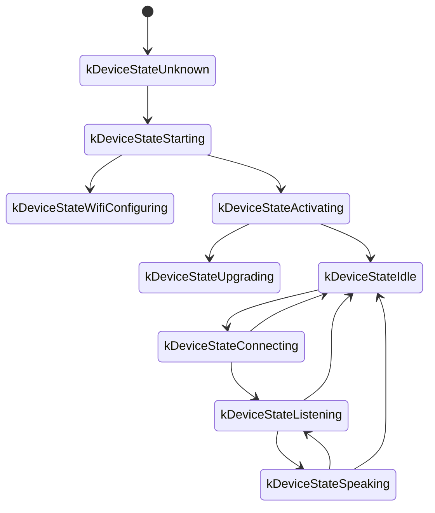
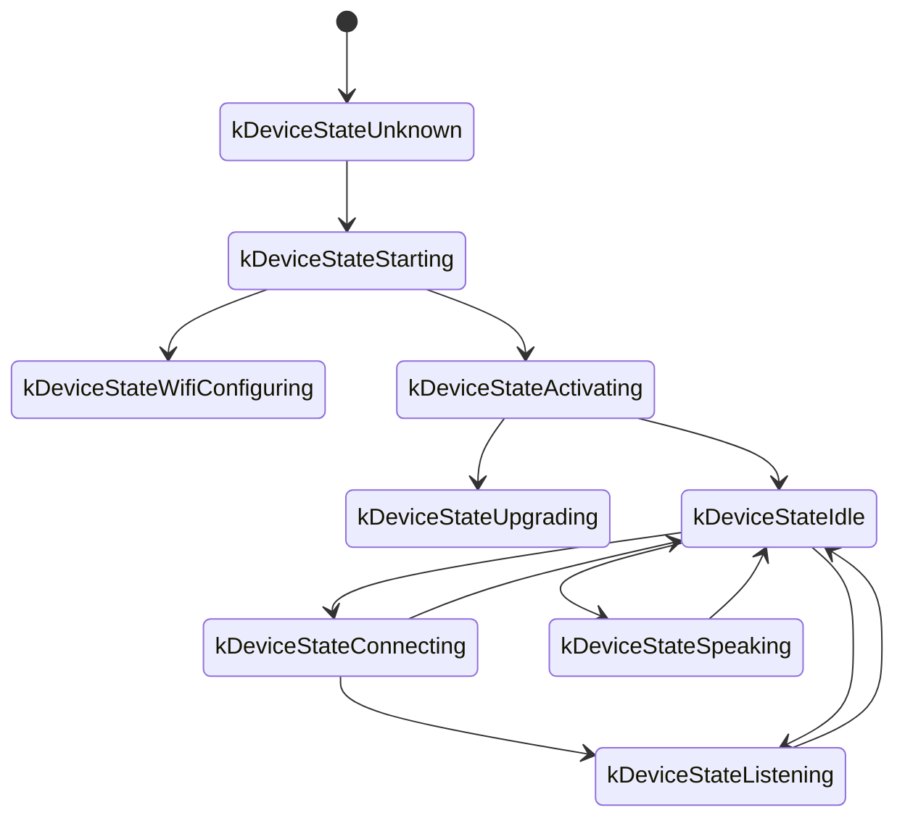

Документ основан на исходном коде проекта и описывает, как устройство обменивается данными с сервером по WebSocket.

Материал реконструирован по коду, поэтому при реальной интеграции необходимо сверять детали с серверной реализацией.

---

## 1. Общая последовательность

1. **Инициализация устройства**  
   - Питание, запуск `Application`  
     - Настройка аудио‑кодека, дисплея, светодиодов  
     - Подключение к сети  
     - Создание экземпляра `WebsocketProtocol`, реализующего интерфейс `Protocol`  
   - Переход в основной цикл (аудио, задачи планировщика и т. д.).

2. **Установка WebSocket‑соединения**  
   - При старте голосовой сессии (`OpenAudioChannel()`):  
     - Берётся URL из конфигурации  
     - Добавляются заголовки (`Authorization`, `Protocol-Version`, `Device-Id`, `Client-Id`)  
     - Вызывается `Connect()` для связи с сервером.

3. **Отправка сообщения `hello`**  
   - После успешного соединения устройство шлёт JSON:
   ```json
   {
     "type": "hello",
     "version": 1,
     "features": {
       "mcp": true
     },
     "transport": "websocket",
     "audio_params": {
       "format": "opus",
       "sample_rate": 16000,
       "channels": 1,
       "frame_duration": 60
     }
   }
   ```
   - `features` формируется на этапе сборки (например, `"mcp": true`).
   - `frame_duration` соответствует `OPUS_FRAME_DURATION_MS`.

4. **Ответ сервера `hello`**  
   - Устройство ждёт JSON с `"type": "hello"` и `"transport": "websocket"`.  
   - Сервер может прислать `session_id`, который устройство сохраняет.  
   - Пример:
   ```json
   {
     "type": "hello",
     "transport": "websocket",
     "session_id": "xxx",
     "audio_params": {
       "format": "opus",
       "sample_rate": 24000,
       "channels": 1,
       "frame_duration": 60
     }
   }
   ```
   - Если корректный ответ не получен за 10 секунд, соединение считается неудачным.

5. **Дальнейший обмен**  
   - Два типа данных:
     1. **Бинарные аудиофреймы** (Opus)
     2. **Текстовые JSON‑сообщения** (состояния диалога, TTS/STT, MCP и т. д.)

   - Обработчики:
     - `OnData(...)`:  
       - `binary == true` → аудиоданные, декодируются как Opus.  
       - `binary == false` → JSON, парсится cJSON и отправляется в бизнес‑логику.
     - `OnDisconnected()` → вызывается при разрыве, переводит устройство в idle.

6. **Закрытие соединения**  
   - `CloseAudioChannel()` закрывает WebSocket и возвращает устройство в режим ожидания.  
   - Если сервер разорвал связь, происходит тот же путь.

---

## 2. Заголовки запроса

В рукопожатии используются:

- `Authorization`: `Bearer <token>`
- `Protocol-Version`: совпадает с `version` в `hello`
- `Device-Id`: MAC-адрес устройства
- `Client-Id`: UUID, сохраняемый в NVS

Сервер может использовать их для аутентификации и маршрутизации.

---

## 3. Варианты бинарного протокола

Параметр `version` в конфигурации задаёт формат бинарных кадров.

### 3.1 Версия 1 (по умолчанию)

Передаются чистые кадры Opus, без метаданных.

### 3.2 Версия 2

Структура `BinaryProtocol2`:
```c
struct BinaryProtocol2 {
    uint16_t version;
    uint16_t type;        // 0: OPUS, 1: JSON
    uint32_t reserved;
    uint32_t timestamp;   // для серверного AEC
    uint32_t payload_size;
    uint8_t payload[];
} __attribute__((packed));
```

### 3.3 Версия 3

```c
struct BinaryProtocol3 {
    uint8_t type;
    uint8_t reserved;
    uint16_t payload_size;
    uint8_t payload[];
} __attribute__((packed));
```

---

## 4. JSON‑сообщения

Текстовые кадры используют следующий набор `type`.

### 4.1 Устройство → сервер

1. **Hello** — см. выше.

2. **Listen**  
   - Поля: `session_id`, `type: "listen"`, `state` (`start|stop|detect`), `mode` (`auto|manual|realtime`).  
   - Пример:
     ```json
     {
       "session_id": "xxx",
       "type": "listen",
       "state": "start",
       "mode": "manual"
     }
     ```

3. **Abort**  
   ```json
   {
     "session_id": "xxx",
     "type": "abort",
     "reason": "wake_word_detected"
   }
   ```

4. **Wake Word Detected**  
   ```json
   {
     "session_id": "xxx",
     "type": "listen",
     "state": "detect",
     "text": "你好小明"
   }
   ```

5. **MCP** — основной способ IoT‑контроля. Payload — JSON-RPC 2.0 (см. `mcp-protocol.md`).  
   Пример ответа устройства:
   ```json
   {
     "session_id": "xxx",
     "type": "mcp",
     "payload": {
       "jsonrpc": "2.0",
       "id": 1,
       "result": {
         "content": [ { "type": "text", "text": "true" } ],
         "isError": false
       }
     }
   }
   ```

### 4.2 Сервер → устройство

1. **Hello** — подтверждение рукопожатия, может включать `session_id` и `audio_params`.

2. **STT** — результат распознавания: `{"type":"stt","text":"..."}`.

3. **LLM** — управление эмоциями/анимацией: `{"type":"llm","emotion":"happy"}`.

4. **TTS** — управление синтезом: `state` = `start|stop|sentence_start`, опционально `text`.

5. **MCP** — вызовы `tools/list` / `tools/call` и т. д.  
   Пример запроса сервера:
   ```json
   {
     "session_id": "xxx",
     "type": "mcp",
     "payload": {
       "jsonrpc": "2.0",
       "method": "tools/call",
       "params": {
         "name": "self.light.set_rgb",
         "arguments": { "r": 255, "g": 0, "b": 0 }
       },
       "id": 1
     }
   }
   ```

6. **System** — системные команды, например `{"type":"system","command":"reboot"}`.

7. **Custom** — пользовательские сообщения (требует `CONFIG_RECEIVE_CUSTOM_MESSAGE`).

8. **Бинарные аудиокадры** — Opus‑данные для воспроизведения.

---

## 5. Аудиоканал

1. **Передача речи** — микрофонные данные проходят AEC/NS/AGC (если включены), кодируются Opus и отправляются двоичными кадрами.
2. **Воспроизведение** — входящие бинарные кадры декодируются и проигрываются, при необходимости выполняется ресемплинг.

---

## 6. Типовые состояния устройства

1. **Idle → Connecting** — пользователь активирует устройство, вызывается `OpenAudioChannel()` и отправляется `hello`.
2. **Connecting → Listening** — после соединения начинается запись и отправка аудиофреймов (`SendStartListening`).
3. **Listening → Speaking** — сервер присылает `{"type":"tts","state":"start"}`, устройство прекращает запись и воспроизводит TTS.
4. **Speaking → Idle** — `tts stop`, устройство завершает воспроизведение и возвращается в idle (или снова слушает, если включен авторежим).
5. Любое состояние → Idle — по `SendAbortSpeaking()` или `CloseAudioChannel()`.

### Диаграмма автоматического режима



### Диаграмма ручного режима



---

## 7. Обработка ошибок

1. **Неудачное соединение** — `Connect(url)` вернул ошибку или не пришёл `hello`; вызывается `on_network_error_()`.
2. **Разрыв сервера** — `OnDisconnected()` → `on_audio_channel_closed_()` и возврат в idle/повторная попытка.

---

## 8. Дополнительные замечания

1. **Аутентификация** — `Authorization: Bearer <token>`; сервер обязан проверять токен.
2. **Сессии** — `session_id` позволяет разделять несколько диалогов.
3. **Аудио** — по умолчанию Opus 16 кГц, моно, длительность кадра 60 мс; внизстрим может идти 24 кГц.
4. **Версия протокола** — настраивается через `version`: 1 (сырой Opus), 2 (с таймстампом), 3 (упрощён).
5. **IoT‑контроль** — использовать MCP (`type: "mcp"`), старый `type: "iot"` устарел.
6. **Ошибочные JSON** — при отсутствии обязательных полей устройство логирует ошибку и игнорирует сообщение.

---

## 9. Пример сессии

1. Устройство → сервер (握手): `hello` (см. выше).
2. Сервер → устройство: ответ `hello` с `session_id`.
3. Устройство → сервер: `{"type":"listen","state":"start"}` + бинарные аудиофреймы.
4. Сервер → устройство: `{"type":"stt","text":"..."}`.
5. Сервер → устройство: `{"type":"tts","state":"start"}` + аудио.
6. Сервер → устройство: `{"type":"tts","state":"stop"}` → возвращаемся в idle.

---

## 10. Итоги

- **Рукопожатие** — обмен `hello` и установка параметров аудио.
- **Аудио** — двусторонние Opus‑кадры, поддержка нескольких бинарных форматов.
- **JSON** — ядро бизнес‑логики: TTS, STT, MCP, System, Custom.
- **Расширяемость** — можно добавлять поля и заголовки по договорённости с сервером.

Надёжная работа требует чёткого согласования значений полей и таймингов между устройством и сервером.
