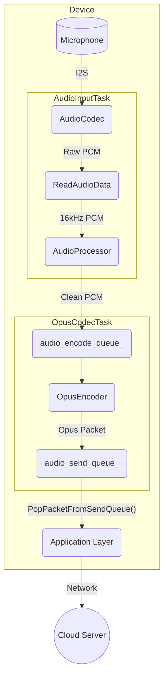
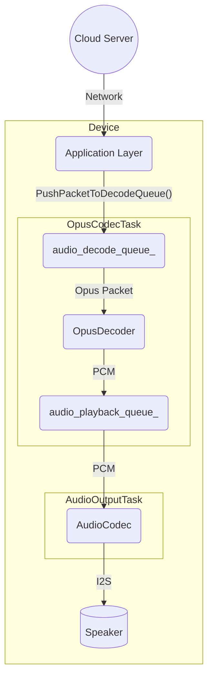

# Архитектура аудиосервиса

Аудиосервис — ключевой компонент, отвечающий за все операции с аудио: снятие сигналов с микрофона, обработку, кодирование/декодирование и воспроизведение через динамик. Он построен модульно и запускает основные части в отдельных задачах FreeRTOS для соблюдения требований реального времени.

## Основные компоненты

- **`AudioService`** — центральный координатор: инициализирует и управляет остальными модулями, задачами и очередями данных.
- **`AudioCodec`** — HAL аппаратного аудиокодека. Обслуживает шину I2S для ввода и вывода аудио.
- **`AudioProcessor`** — выполняет онлайн‑обработку микрофонного сигнала (AEC, шумоподавление, VAD). Типовая реализация `AfeAudioProcessor` использует Audio Front-End из ESP-ADF.
- **`WakeWord`** — детектор ключевых слов (например, «你好，小智», «Hi, ESP»). Работает параллельно с основной обработкой до момента срабатывания.
- **`OpusEncoderWrapper` / `OpusDecoderWrapper`** — кодируют PCM в Opus и обратно. Выбор Opus обусловлен высокой степенью сжатия и низкой задержкой.
- **`OpusResampler`** — утилита для преобразования частоты дискретизации (например, до 16 кГц, требуемых для обработки).

## Модель потоков

Сервис использует три основные FreeRTOS‑задачи, чтобы конвейер работал параллельно:

1. **`AudioInputTask`** — читает сырые PCM‑данные из `AudioCodec` и направляет их либо в `WakeWord`, либо в `AudioProcessor` в зависимости от состояния.
2. **`AudioOutputTask`** — воспроизведение. Берёт PCM из `audio_playback_queue_` и отдаёт его в `AudioCodec` для вывода на динамик.
3. **`OpusCodecTask`** — кодек‑работник: забирает PCM из `audio_encode_queue_`, кодирует в Opus и кладёт в `audio_send_queue_`; одновременно берёт Opus‑пакеты из `audio_decode_queue_`, декодирует в PCM и отправляет в `audio_playback_queue_`.

## Потоки данных

Есть два основных направления: подача аудио (uplink) и приём (downlink).

### 1. Подача аудио (uplink)

Захватывает звук, обрабатывает, кодирует и передаёт на сервер.

- `AudioInputTask` непрерывно читает PCM из `AudioCodec`.
- Сигнал обрабатывается (`AEC`, `VAD`) в `AudioProcessor`.
- Очищенный PCM отправляется в `audio_encode_queue_`.
- `OpusCodecTask` кодирует данные в Opus и складывает пакеты в `audio_send_queue_`.
- Приложение забирает пакеты и отправляет по сети.

### 2. Приём аудио (downlink)

Получает закодированные данные, декодирует и воспроизводит их.

- Приложение принимает Opus‑пакеты и помещает их в `audio_decode_queue_`.
- `OpusCodecTask` декодирует пакеты в PCM и отправляет их в `audio_playback_queue_`.
- `AudioOutputTask` берёт PCM и передаёт его в `AudioCodec` для вывода.

## Энергосбережение

Чтобы экономить энергию, входные (ADC) и выходные (DAC) каналы аудиокодека автоматически отключаются после периода бездействия (`AUDIO_POWER_TIMEOUT_MS`). Таймер `audio_power_timer_` отслеживает активность и управляет состоянием питания. Как только требуется запись или воспроизведение, каналы снова включаются.
